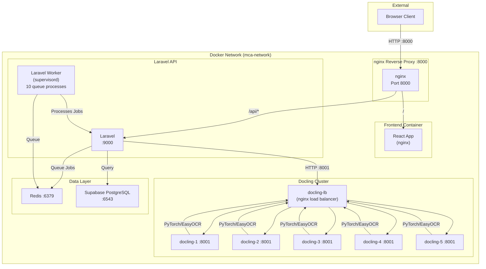
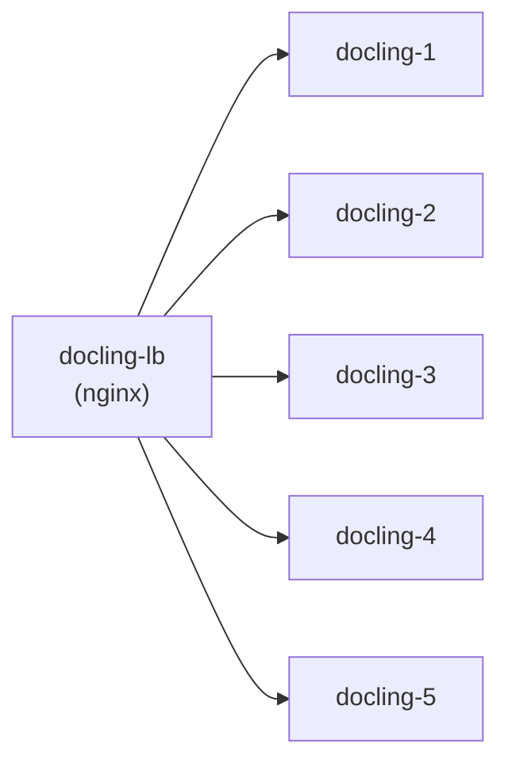
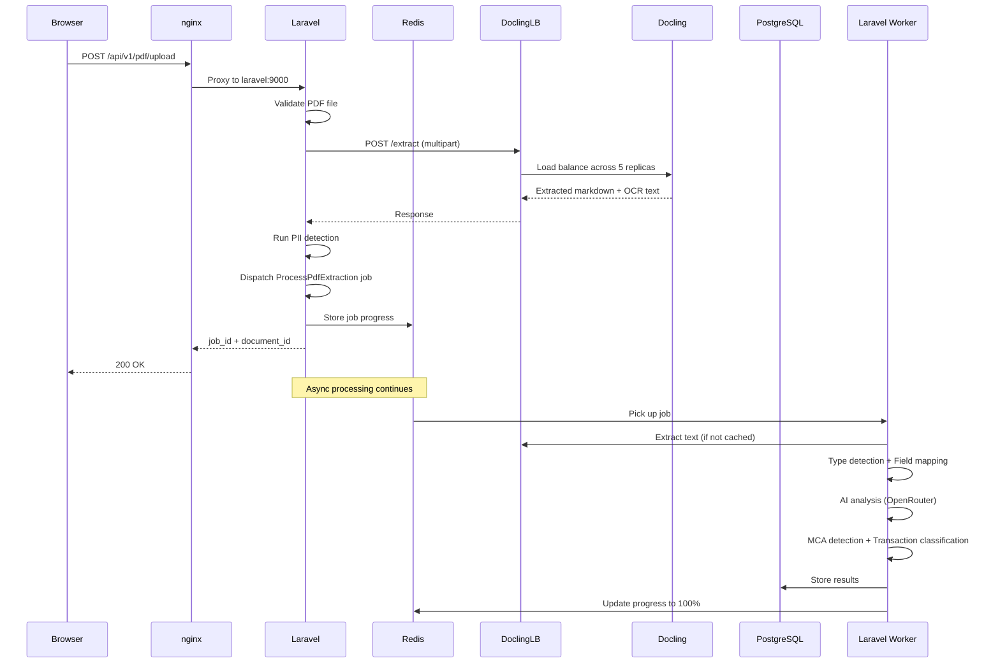
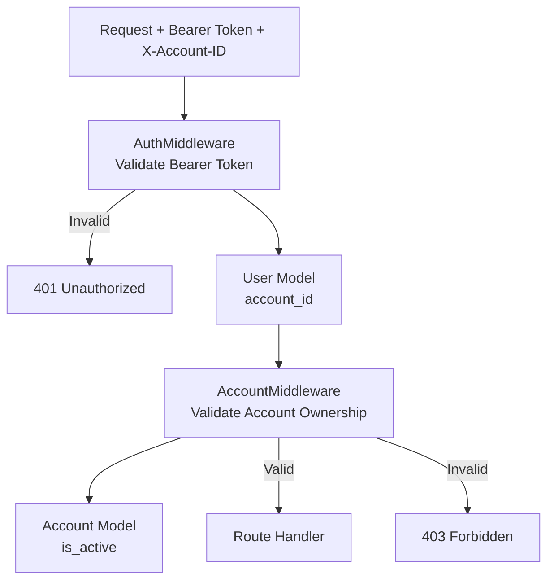

# MCA PDF Scrubber - Architecture Overview

## System Architecture

MCA PDF Scrubber is a full-stack microservice application for uploading PDF documents and performing text extraction, analysis, and PII scrubbing. The system uses a multi-container Docker architecture with nginx as the reverse proxy entry point.

## High-Level Architecture Diagram



## Service Responsibilities

### nginx Reverse Proxy (Port 8000)

The single entry point for all services. Routes traffic based on URL path:

| Path | Destination | Purpose |
|------|-------------|---------|
| `/` | frontend:80 | React static files |
| `/api/*` | laravel:9000 | Laravel API endpoints |
| `/docling/*` | docling-lb:8001 | Docling service (PDF extraction) |

**Key Configuration Files:**
- `/docker/nginx.conf` - Production nginx configuration
- `/docker/nginx.dev.conf` - Development nginx configuration

### React Frontend

- **Technology:** React 18 + TypeScript + Tailwind CSS + Vite
- **Container:** Served exclusively through nginx (no direct port access in production)
- **Dev Port:** 4200 (via docker-compose.dev.yml with hot-reload)
- **App Name:** "Dave"

**Key Components:**
- `ExtractionContext` - Centralized state for extraction workflow with polling
- `UploadSection` - PDF upload UI
- `StatementsView` - Transaction statements display
- `ComparativeView` - Multi-document comparison
- `InsightsScorecard` - PDF analytics dashboard
- `DocumentLibrary` - Document management UI

### Laravel API (Port 9000)

- **Technology:** Laravel 11 (PHP 8.2+)
- **Database:** SQLite (local) / Supabase PostgreSQL (production)
- **Cache/Queue:** Redis
- **AI Analysis:** OpenRouter (configurable model via `OPENROUTER_MODEL`)

**Controllers:**
| Controller | Purpose |
|------------|---------|
| `AuthController` | User registration, login, logout, me |
| `PdfController` | PDF upload, analyze, scrub operations |
| `ExtractionController` | Async extraction with job progress tracking |
| `DocumentController` | Document CRUD and status management |
| `BatchController` | Batch document processing |
| `ComparisonController` | Document comparison (balances, risk, transactions) |
| `HealthController` | Health check endpoints |

**Middleware:**
| Middleware | Purpose |
|------------|---------|
| `AuthMiddleware` | Bearer token authentication via `api_token` |
| `AccountMiddleware` | Multi-tenancy via `X-Account-ID` header validation |
| `CorsMiddleware` | CORS headers for cross-origin requests |

### Laravel Queue Workers

- **Manager:** supervisord (manages 10 worker processes)
- **Queue Connection:** Redis
- **Job Timeout:** 900 seconds (15 minutes)
- **Max Tries:** 5 with exponential backoff

**Supervisord Programs:**
- `php-fpm` - PHP FastCGI Process Manager
- `nginx` - Internal nginx for PHP-FPM
- `laravel-worker-1` through `laravel-worker-10` - Queue consumers

### Python Docling Service (5 Replicas)

- **Technology:** Python 3.10+ / FastAPI / docling library / EasyOCR
- **Load Balancer:** nginx (docling-lb)
- **Device:** CUDA (GPU) if available, otherwise CPU

**Architecture:**


**Features:**
- Async thread-pool offloading
- Smart OCR gating (skips OCR for large PDFs >20 pages to prevent OOM)
- Prometheus metrics endpoint (`/metrics`)
- Health check endpoint (`/health`)

**Python Service Files:**
- `server.py` - FastAPI server with async endpoints
- `converter.py` - Docling PDF-to-markdown conversion
- `ocr.py` - EasyOCR for image-based PDF content
- `models.py` - Pydantic request/response models
- `config.py` - Device detection (CUDA/CPU) and worker configuration

### Redis

- **Purpose:** Cache + Queue broker
- **Persistence:** Enabled with `redis_data` volume
- **Health Check:** `redis-cli ping`

### Supabase PostgreSQL

- **Purpose:** Persistent storage for users, accounts, documents, batches
- **Connection:** Via PgBouncer connection pooler

## Data Flow

### PDF Upload and Processing Flow



### Async Extraction Pipeline (ProcessPdfExtraction Job)

The job orchestrates the full extraction pipeline:

1. **Cache Check** (10%) - Stampede protection via Redis lock
2. **Text Extraction** (35%) - Docling + EasyOCR
3. **Document Type Detection** (35%) - `DocumentTypeDetector`
4. **Field Mapping** (55%) - `FieldMapper` → specialized parsers
5. **Quality Analysis** (75%) - `ExtractionScorer`
6. **PII Detection** (75%) - `PdfAnalyzerService` + `PiiPatterns`
7. **Balance Extraction** (80%) - `BalanceExtractorService`
8. **AI Analysis** (85%) - `OpenRouterService` / `BaseAIService`
9. **MCA Detection** (92%) - `McaAiService` + `McaDetectionService`
10. **Transaction Classification** (95%) - `TransactionClassificationService`

## Multi-Tenancy



**Rules:**
- All API endpoints (except health/auth) require `Authorization: Bearer <token>`
- `AuthMiddleware` validates token against `users` table
- `AccountMiddleware` enforces `X-Account-ID` header matches authenticated user's `account_id`
- Documents and batches belong to an account and are isolated per user

## Scaling Architecture

| Component | Replicas | Workers | Memory Limit | Purpose |
|-----------|----------|---------|--------------|---------|
| nginx | 1 | - | 128M | Reverse proxy |
| frontend | 1 | - | 256M | Static file serving |
| laravel | 1 | - | 512M | API requests |
| laravel-worker | 1 | 10 (supervisord) | 512M | Queue processing |
| docling-1..5 | 5 | 1 each | 4G each | PDF extraction |
| docling-lb | 1 | - | 64M | Load balancing |
| redis | 1 | - | 256M | Cache + Queue |

## Key File Locations

```
backend/
├── app/
│   ├── Http/Controllers/
│   │   ├── AuthController.php
│   │   ├── PdfController.php
│   │   ├── ExtractionController.php
│   │   ├── DocumentController.php
│   │   ├── BatchController.php
│   │   ├── ComparisonController.php
│   │   └── HealthController.php
│   ├── Http/Middleware/
│   │   ├── AuthMiddleware.php
│   │   ├── AccountMiddleware.php
│   │   └── CorsMiddleware.php
│   ├── Jobs/
│   │   └── ProcessPdfExtraction.php
│   ├── Models/
│   │   ├── User.php
│   │   ├── Account.php
│   │   ├── Document.php
│   │   └── Batch.php
│   └── Services/
│       ├── DoclingService.php
│       ├── PdfAnalyzerService.php
│       ├── PiiPatterns.php
│       ├── BaseAIService.php
│       ├── OpenRouterService.php
│       ├── McaAiService.php
│       ├── McaDetectionService.php
│       ├── TransactionClassificationService.php
│       ├── BalanceExtractorService.php
│       ├── DocumentTypeDetector.php
│       ├── FieldMapper.php
│       └── FieldMappers/
│           ├── BankStatementTableParser.php
│           ├── FieldValueCleaner.php
│           ├── GarbageDetector.php
│           └── HeadingParser.php
├── routes/
│   └── api.php
└── config/

python-service/src/
├── server.py          # FastAPI app
├── converter.py       # Docling conversion
├── ocr.py             # EasyOCR
├── models.py          # Pydantic models
└── config.py          # Device/Wroker config

docker/
├── nginx.conf         # Production nginx
├── nginx.dev.conf     # Dev nginx
├── docling-lb.conf    # Docling load balancer
├── prometheus.yml     # Prometheus config
├── supervisord.conf   # Queue worker config
└── grafana/           # Grafana dashboards
```
